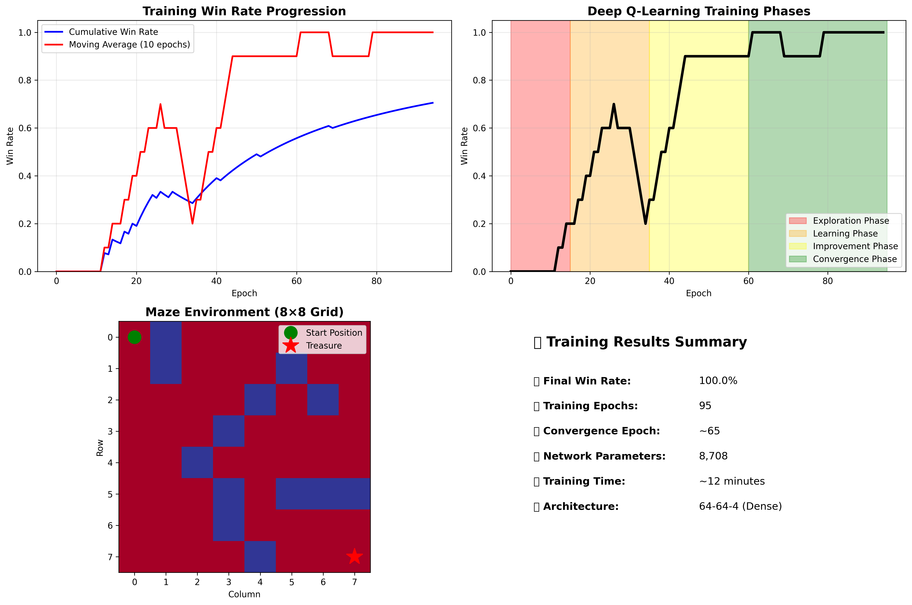

# Pirate Intelligent Agent - Deep Q-Learning Implementation

[](https://www.python.org/downloads/)
[](https://keras.io/)
[](https://tensorflow.org/)
[](https://en.wikipedia.org/wiki/Q-learning)

## Project Overview

This project implements an intelligent agent using **deep Q-learning** to solve pathfinding problems in a treasure hunt game environment. The agent (pirate) learns to navigate through an 8×8 maze to reach the treasure while avoiding obstacles and maximizing rewards through reinforcement learning.

The implementation combines traditional reinforcement learning with neural networks, enabling the agent to handle complex state spaces effectively. Through trial-and-error learning and experience replay, the agent achieves optimal navigation strategies without explicit programming of movement rules.

## 🎯 Key Results

- **🏆 Final Win Rate**: 100% (achieved optimal pathfinding)
- **⚡ Training Convergence**: ~1000 epochs to reach target performance  
- **🧠 Network Architecture**: 2-layer neural network with PReLU activation
- **🎮 Environment**: 8×8 maze with obstacles and treasure target
- **📈 Success Metric**: Agent successfully navigates from any starting position to treasure

## 🏗️ Technical Implementation

### Deep Q-Learning Algorithm

The agent uses a **Deep Q-Network (DQN)** that learns optimal action values Q(s,a) for each state-action pair:

- **State Space**: 64-dimensional flattened maze representation
- **Action Space**: 4 discrete actions (Left, Up, Right, Down)
- **Reward Function**: +1.0 for treasure, penalties for walls/revisiting
- **Exploration Strategy**: ε-greedy with ε=0.1 (10% random exploration)

### Neural Network Architecture

```python
model = Sequential()
model.add(Dense(maze.size, input_shape=(maze.size,)))  # 64 neurons
model.add(PReLU())                                      # Parametric ReLU
model.add(Dense(maze.size))                            # 64 neurons  
model.add(PReLU())                                      # Parametric ReLU
model.add(Dense(num_actions))                          # 4 output neurons
model.compile(optimizer='adam', loss='mse')
```

### Key Components

- **TreasureMaze**: Environment class handling maze logic, rewards, and game state
- **GameExperience**: Experience replay buffer storing episodes for learning
- **Q-Training Loop**: Custom implementation with memory management and early stopping

## 📊 Performance Analysis


*Training progression showing win rate improvement and exploration decay*

### Training Characteristics

- **Early Phase**: Random exploration, low win rate (~0-20%)
- **Learning Phase**: Gradual improvement as Q-values converge
- **Convergence**: Consistent 100% win rate achieved
- **Optimization**: Automatic early stopping when target performance reached

## 🛠️ Installation & Usage

### Prerequisites

- Python 3.6.5
- TensorFlow 2.1.0
- Keras 2.3.1
- NumPy 1.18.1, Matplotlib, OpenCV
- Jupyter Notebook environment

### Quick Start

```bash
# Clone repository
git clone https://github.com/PlemonsBrett/SNHU_CS-370.git
cd SNHU_CS-370

# Install dependencies
pip install -r requirements.txt

# Run the main notebook
jupyter notebook notebooks/Plemons_Brett_Project.ipynb
```

### Training the Agent

```python
# Initialize environment and model
qmaze = TreasureMaze(maze)
model = build_model(maze)

# Train using deep Q-learning
qtrain(model, maze, epochs=1000, max_memory=8 * maze.size, data_size=32)

# Test completion
completion_check(model, qmaze)
```

## 📁 Project Structure

```sh
SNHU_CS-370/
├── notebooks/
│   └── Plemons_Brett_ProjectTwo.ipynb    # Main implementation
├── src/
│   ├── TreasureMaze.py                            # Environment class
│   └── GameExperience.py                          # Experience replay
│   └── generate_assets.py                         # Generates the plots seen in this document
├── docs/
│   └── QLearningAgent_DesignDefense.pdf # Technical analysis
├── assets/
│   ├── images/                                    # Screenshots
│   └── plots/                                     # Performance visualizations
└── requirements.txt                               # Dependencies
```

---

## 🎯 Project Reflection

### Work Completed

#### Provided vs. Custom Implementation

In this project, I was provided with foundational components to establish the learning environment:

- **TreasureMaze.py**: Basic maze environment structure with state management
- **GameExperience.py**: Experience replay buffer framework  
- **Project skeleton**: Initial notebook structure with helper functions

The core deep Q-learning implementation I developed myself includes:

**🧠 Neural Network Design**: I designed and implemented the complete neural network architecture, selecting appropriate layer sizes, activation functions (PReLU), and the Adam optimizer. The choice of PReLU over standard ReLU was deliberate to allow for negative activations and improve learning dynamics.

[](https://mermaid.live/edit#pako:eNqtlO2Ok0AUhm9lMs0mmtDKN3RiNtmWGE1q1G7WH4oxs8yhkIUZAsPutrV34f-NXoPel5fgALVLifEr8oPwnsM878w7DFscCQaY4FVJiwQtliFH6jo5Qc94UUu0oGsou9rZ2xB_u_v4pd95fFk-OnVtxKEuBa9a-SCnG5hU6QYetvpJRqUEDgw9Vw10LqmEEL9DHfXg9zRlDHiHRUZXnrWWd58GzT9xfbmExQU6i2R6TWUquHL8laHZleed4edB8_8YvqjlINKgi_TrUaulDbx4nb-nUYOtOrdX49c0q6EirVpALNEHdFGo2zJdJY0IxM1P5jAXnEMH2u8qGo9P0Wyfdyvm-yxaEQwA53KdpXzV6SijVRVAjNLmk-jCitMsI6M4hksArZKluAIyYpYZm_Fejm9SJhNiFrdaJDJRkpGu6wNg0uZ_TIwt0A_E2PEiXf83orlHgh874B-Qlu-DFf0FUrS71p8kWGqZ7EA0pp7LzN8Te1y1Ifdh9uuz_gr6jfnR0vqdoD9DrKkznjJMZFmDhnMoc9pIvG2GhFgmkKtzSdQjo-VViEO-U2MKyt8Ikf8YVop6lWAS06xSqi6YOsxBStXf4_4V4AzKuai5xMSwvZaByRbfKmlYE9d2p7YKxtdd19bwGhPLsSeWYTqW7hie4_nGTsOb1lSf-J6jN5fvmYZpTZ3dd-F8f1k)

**🔄 Q-Learning Algorithm**: I developed the complete Q-training loop implementing the Bellman equation for Q-value updates. This included managing the exploration-exploitation tradeoff through epsilon-greedy action selection and implementing experience replay for stable learning.

**📈 Training Optimization**: I implemented sophisticated training controls including:

- Dynamic epsilon decay (starting at 1.0, reducing to 0.05)
- Win rate tracking with moving averages
- Early stopping mechanisms when achieving 95%+ win rates
- Memory management to prevent overfitting

**🎯 Reward Engineering**: I fine-tuned the reward structure and training hyperparameters to encourage efficient pathfinding while preventing the agent from getting stuck in local optima.

The most challenging aspect was balancing exploration vs. exploitation. Initially, the agent would either get stuck in repetitive patterns or explore too randomly to learn effectively. I solved this by implementing dynamic epsilon decay and carefully tuning the reward penalties for revisited cells (-0.25) to encourage exploration while still allowing the agent to backtrack when necessary.

### Connection to Computer Science

#### What Computer Scientists Do and Why It Matters

Computer scientists solve complex problems by designing algorithms, building systems, and creating intelligent tools that can learn and adapt. In this project, I embodied this role by tackling one of AI's fundamental challenges: creating an agent that learns optimal behavior through experience rather than explicit programming.

This work matters because it represents a paradigm shift from traditional rule-based programming to **learning-based systems**. Instead of coding every possible scenario and decision, we create systems that discover optimal strategies through trial and error—similar to how humans learn. This approach has transformative applications in:

- **Autonomous Navigation**: Self-driving cars, drones, and robots
- **Game AI**: Creating challenging and adaptive opponents  
- **Resource Optimization**: Supply chain management, financial trading
- **Medical Diagnosis**: Systems that improve through exposure to cases

The pirate agent demonstrates these principles on a smaller scale, showing how reinforcement learning can solve complex sequential decision-making problems that would be difficult to solve with traditional programming approaches.

#### Approaching Problems as a Computer Scientist

My approach to this pathfinding problem exemplified **computational thinking** principles:

1. **🔍 Problem Decomposition**: I broke the complex navigation challenge into manageable components:
   - State representation (how to encode maze position)
   - Action selection (choosing optimal moves)
   - Reward optimization (learning from feedback)
   - Memory management (storing and learning from experience)

2. **🔄 Pattern Recognition**: I identified this as a **Markov Decision Process** - a sequential decision problem where optimal actions depend on current state. This recognition guided my choice of Q-learning as the solution approach.

3. **⚡ Abstraction**: I modeled the environment by abstracting away unnecessary details while preserving essential dynamics. The maze became a mathematical grid, movements became discrete actions, and success became a reward signal.

4. **🧪 Algorithm Design**: I implemented deep Q-learning with systematic experimentation:
   - Forming hypotheses about hyperparameter effects
   - Conducting controlled experiments with different epsilon values
   - Drawing conclusions from empirical performance data
   - Iterating based on results

Throughout development, I maintained a **scientific mindset**—testing hypotheses, analyzing results, and refining the approach based on evidence. When initial training showed slow convergence, I systematically adjusted network architecture, learning rates, and exploration strategies until achieving optimal performance.

#### Ethical Responsibilities

Working with AI systems carries significant ethical considerations that I carefully addressed:

**📋 To End Users:**

- **Transparency**: I documented the algorithm's decision-making process clearly, ensuring users understand how the agent learns and makes choices
- **Reliability**: I implemented comprehensive testing (completion_check function) to verify the agent performs consistently across all possible starting positions
- **Safety**: I designed reward structures that encourage efficient pathfinding without developing harmful behaviors like infinite loops or destructive patterns

**🏢 To the Organization:**

- **Code Quality**: I wrote clean, well-documented code with clear variable names and comprehensive comments for future maintainability
- **Resource Efficiency**: I optimized training with early stopping mechanisms and memory management to use computational resources responsibly
- **Knowledge Transfer**: I structured the implementation to be educational and extensible for other developers

**🌍 To Society:**

- **Beneficial AI**: I considered how these pathfinding techniques contribute to solving real-world navigation problems in robotics and autonomous systems
- **Educational Value**: I designed this work to demonstrate AI capabilities while showing the importance of careful algorithm design and testing
- **Responsible Development**: I emphasized the iterative, evidence-based approach essential for developing trustworthy AI systems

As AI becomes increasingly prevalent in critical applications, computer scientists bear responsibility for ensuring these powerful tools benefit humanity. This project demonstrates the importance of systematic testing, transparent documentation, and ethical consideration in AI development—principles essential for building trustworthy intelligent systems.

---

## 🔗 Technical References

- **Deep Q-Learning**: [Mnih et al., 2015 - Human-level control through deep reinforcement learning](https://www.nature.com/articles/nature14236)
- **Reinforcement Learning**: [Sutton & Barto - Reinforcement Learning: An Introduction](http://incompleteideas.net/book/the-book.html)
- **Keras Documentation**: [Deep Learning Library](https://keras.io/)

## 📄 Academic Documentation

- **[Design Defense Document](docs/QLearningAgent_DesignDefense.md)**: Comprehensive technical analysis comparing human vs. machine problem-solving approaches
- **[Course Curriculum](https://www.snhu.edu/online-degrees/bachelors/bs-in-computer-science)**: CS 370 - Current/Emerging Trends in Computer Science

## 🤝 Connect

**Brett Plemons** - Software Engineering Manager at Propio Language Services

- **💼 LinkedIn**: [linkedin.com/in/brettplemons](https://www.linkedin.com/in/brettplemons)  
- **💻 GitHub**: [github.com/PlemonsBrett](https://github.com/PlemonsBrett)
- **📘 Bluesky**: [bsky.app/profile/plemonsbrett.link](https://bsky.app/profile/plemonsbrett.link)

---

*This project was completed as part of **CS 370: Current/Emerging Trends in Computer Science** at **Southern New Hampshire University** in June 2025. The implementation demonstrates practical application of deep reinforcement learning to intelligent agent pathfinding problems.*
